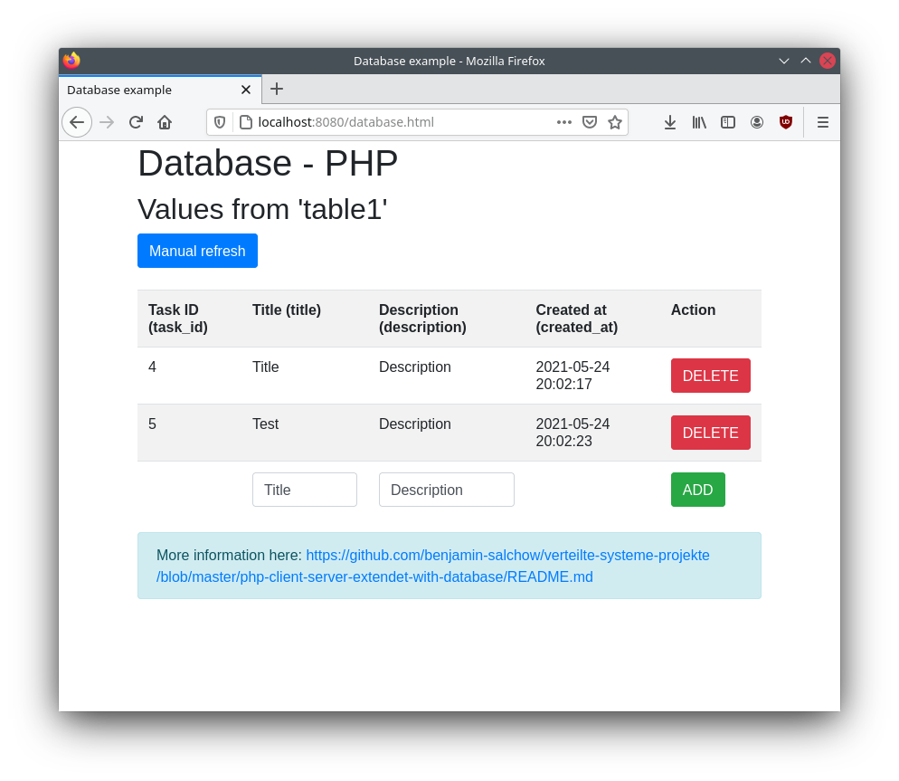

# Client - (Web-)Server Extended mit einer Datenbank in PHP

## Allgemein

In diesem Beispiel wird ein PHP-Webserver im Container (mittels Apache) gestartet und Zugriffspunkte (Pfade) definiert. Darüber hinaus wird ein 'MariaDB'-Datenbankcontainer angelegt, welcher vom Webserver verwendet wird.

Bitte schaue zuerst das Beispiel `php-client-server` an: [- php-client-server-Beispiel ->](../php-client-server/README.md)

**Hinweis:** Dieses Beispiel ist auch in JavaScript in Node.JS verfügbar: [- node-client-server-extended-with-database Beispiel ->](../node-client-server-extended-with-database/README.md)




### Datenbank

Die Datenbank ist eine `MariaDB`-Datenbank, welche eine OpenSource-Weiterentwicklung der `MySQL`-Datenbank ist.

Alles zur Datenbank findet man im Ordner `db`. Dieser wird benötigt, da beim Start der Datenbank das `database.sql` Backup geladen und in die Datenbank automatisch eingespielt wird.

Genau genommen nehmen wir das vorhandene offizielle `MariaDB` Container-Image und laden nur unser SQL-Backup rein. Das `database.sql` kann man über PhpMyAdmin exportieren und einfach überschreiben.

Die Datenbankinitialisierung findet **nur** statt, wenn der Container das erste Mal gestartet wird, sprich, wenn man das erste Mal `docker-compose up --build` ausführt. Bei jedem weiteren Start mittels `docker-compose up --build` werden die vorhandenen Daten genommen und es wird das Backup `database.sql` **nicht** eingespielt.

Konkret bedeutet das, dass beim ersten Start der Datenbank dies etwas länger dauert, bei jedem weiteren Start geht es deutlich schneller. Wenn man möchte, dass die Datenbank komplett gelöscht wird, dann muss man die Container alle löschen mittels `docker-compose down`. Beim nächsten Start mit `docker-compose up --build` wird dann die Datenbank neu erstellt.

### Server

Der Server benötigt die Datenbank und daher darf der Server erst starten, wenn die Datenbank bereit ist. 

Bitte öffne nach dem Start folgende URL: `http://localhost:8080/`

Danach wird man automatisch auf die `index.html` geleitet, die im `src` des Servers liegt.
Mit einem Klick auf den `database.html` Link kommt man auf folgende Seite: `http://localhost:8080/static/database.html`.
Dort befindet sich alles über den Datenbankzugriff, was im Folgenden erklärt wird.

Der allgemeine Zugangspunkt ist:
 * GET http://localhost:8080/
   * Allgemeiner Einstiegspunkt, der automatisch den Client zu http://localhost:8080/index.html weiterleitet.

#### Button-Beispiel
Dieses Projekt beinhaltet ein `Button`-Beispiel, welches klassisch sowie mit `AJAX` funktioniert.
Alle dazugehörigen Informationen können in der Datei `button.html` (Webseite) sowie im PHP-Skript
`button.php` nachgeschaut werden.

Folgende Zugriffspunkte stehen hierbei zur Verfügung:
 * POST http://localhost:8080/button.php
   * Button 1 Beispiel von der static Webseite - `server/src/index.html`.
   * Der Name im Formular wird an den Server geschickt und in diesem Beispiel wieder zurück zu dem Client in einem JSON.
   * Weitere Informationen: https://www.w3schools.com/php/php_forms.asp
 * GET http://localhost:8080/button.php
   * Button 2 Beispiel von der static Webseite - `server/src/index.html`.
   * Diese wird durch AJAX automatisch in der aktuellen Seite eingebunden und angezeigt.
   * Weitere Informationen: https://www.w3schools.com/xml/ajax_intro.asp

#### Datenbank-Beispiel
Die `database.html` befindet sich in `./server/src/database.html` und beinhaltet den Client (Webbrowser) Code, der im Browser ausgeführt wird. Funktionen werden jedoch von dem PHP-Skript `database.php` bereitgestellt, was im selben Ordner liegt.

Dabei werden folgende Zugriffspunkte von dem Skript `database.php` verwendet:

Zugriffspunkte:
 * GET http://localhost:8080/database.php
   * Gibt die komplette `table1` als JSON-Antwort zum Client.
 * DELETE http://localhost:8080/database.php?id=`id`
   * Löscht die Reihe aus der `table1` mit der angegebenen `id`.
 * POST http://localhost:8080/database.php
   * Das übergebene JSON-Objekt an diese URL, welches folgende Struktur haben muss:
   * `{ title: "", description: ""}`
   * wird zur `table1` hinzugefügt. Dabei werden die `task_id` sowie die `created_at` automatisch von der Datenbank ausgefüllt (siehe query im Sourcecode).

Die `database.html` spielt dabei eine wichtige Rolle. In dieser Datei befindet sich `javascript` Code, welcher diese Anfragen stellt und auch in die HTML-Seite integriert (daher bitte die `database.html` anschauen).
Dabei gibt es auch ein Error-Handling, welches über den `alert` angezeigt wird. Jegliche Funktion wie löschen oder hinzufügen führt anschließend wieder das Laden der Datenbank aus, damit der neue Zustand gezeigt wird.

#### Datenbankverbindung

In dem Sourcecode wird die Datenbank automatisch vom `db`-Container beim Start initialisiert.

Das Skirpt `database.php` verbindet sich mit der Datenbank und verwendet hierfür Environment-Variablen,
welche von der `docker-compose.yaml` definiert werden.

**Hinweis:** Bitte immer in jedem PHP-Skript, welches die Datenbank verwendet, die Connection hierzu mittels:
`$conn->close();` sauber beenden.

**Hinweis:** In der Praxis muss man jegliche SQL-Query vor dem bekannten Angriff der `SQL-Injection` schützen. Dies sollte in der Vorlesung `IT-Sicherheit` erklärt werden.

### PhpMyAdmin

Im `docker-compose.yaml` wird auch ein `phpMyAdmin`-Container gestartet, der als Hilfestellung zum Erstellen, Testen sowie Debuggen der Datenbank dient. Dieser kann über:

`http://localhost:8085/`

erreicht werden. Hierbei muss man wie im `docker-compose.yaml` den Benutzernamen `MYSQL_USER` sowie das Passwort `MYSQL_PASSWORD` angeben. 

Dies kann auch für den Export verwendet werden mittels `Exportieren` -> `Schnell` -> `SQL`. Die daraus resultierende Datei kann dann in dem Ordner `db` als `database.sql` hinterlegt werden. Bei dem nächsten Neuerstellen des Datenbank-Containers wird diese dann automatisch geladen.

### Static Files

Alle statischen Dateien sowie PHP-Skripte liegen wie bereits beschrieben in dem Ordner `src`, welcher als `WEB_ROOT` direkt über den Zugriff mit dem Browser auf http://127.0.0.1:8080/ verfügbar sind. Am besten werden relative Pfade zu den Dateien verwendet (siehe z.B. `static.html` Datei). Diese Datei befindet sich in `./server/src/static.html`.

In diesem Beispiel ist beschrieben, wie man Bilder und eigene CSS-Dateien referenzieren kann. Darüber hinaus können auch Javascript-Dateien so richtig ausgegliedert werden. Idealerweise überlegt man sich eine sinnvolle Ordnerstruktur, um dies auch gut warten zu können.

## Ausführung mit Docker und docker-compose

**Hinweis:** Beachte, dass die `docker-compose.yml` im Hauptverzeichnis des Projektes liegt. Die Ordnerstruktur enthält einen Ordner `db` und einen Ordner `server`, welche jeweils die benötigten Dateien sowie eine eigene `Dockerfile` haben, welche die Container beschreiben. Die Container sind unabhängig und unterscheiden sich. Innerhalb der `docker-compose.yml` wird unter `build` der Ordner angegeben, welcher die `Dockerfile` beinhaltet.


In diesem Ordner können mit dem Terminal und folgendem Befehl:

```sh
# start mit
docker-compose up --build
```

automatisch der "Server"-Container, der Datenbank-Container und phpMyAdmin gestartet werden.
Darüber hinaus werden die Container mittels des `--build`-Flags auch neu gebaut, damit aktuelle Änderungen enthalten sind.

Der Output sieht wie folgt aus:
```sh
Successfully built 25c51e40c776
Successfully tagged php-client-server-with-database_server:latest
Creating php-client-server-with-database_meinecooledb_1 ... done
Creating php-client-server-with-database_phpmyadmin_1   ... done
Creating php-client-server-with-database_server_1       ... done
Attaching to php-client-server-with-database_meinecooledb_1, php-client-server-with-database_phpmyadmin_1, php-client-server-with-database_server_1
meinecooledb_1  | 2021-05-24 19:42:35+00:00 [Note] [Entrypoint]: Entrypoint script for MySQL Server 1:10.4.12+maria~bionic started.
meinecooledb_1  | 2021-05-24 19:42:36+00:00 [Note] [Entrypoint]: Switching to dedicated user 'mysql'
phpmyadmin_1    | phpMyAdmin not found in /var/www/html - copying now...
phpmyadmin_1    | Complete! phpMyAdmin has been successfully copied to /var/www/html
phpmyadmin_1    | AH00558: apache2: Could not reliably determine the server's fully qualified domain name, using 172.27.0.2. Set the 'ServerName' directive globally to suppress this message
phpmyadmin_1    | AH00558: apache2: Could not reliably determine the server's fully qualified domain name, using 172.27.0.2. Set the 'ServerName' directive globally to suppress this message
meinecooledb_1  | 2021-05-24 19:42:36+00:00 [Note] [Entrypoint]: Entrypoint script for MySQL Server 1:10.4.12+maria~bionic started.
phpmyadmin_1    | [Mon May 24 19:42:36.138226 2021] [mpm_prefork:notice] [pid 1] AH00163: Apache/2.4.38 (Debian) PHP/7.4.4 configured -- resuming normal operations
phpmyadmin_1    | [Mon May 24 19:42:36.138279 2021] [core:notice] [pid 1] AH00094: Command line: 'apache2 -D FOREGROUND'
server_1        | AH00558: apache2: Could not reliably determine the server's fully qualified domain name, using 172.27.0.4. Set the 'ServerName' directive globally to suppress this message
server_1        | AH00558: apache2: Could not reliably determine the server's fully qualified domain name, using 172.27.0.4. Set the 'ServerName' directive globally to suppress this message
server_1        | [Mon May 24 19:42:36.295493 2021] [mpm_prefork:notice] [pid 1] AH00163: Apache/2.4.38 (Debian) PHP/7.4.19 configured -- resuming normal operations
server_1        | [Mon May 24 19:42:36.295532 2021] [core:notice] [pid 1] AH00094: Command line: 'apache2 -D FOREGROUND'
meinecooledb_1  | 2021-05-24 19:42:36+00:00 [Note] [Entrypoint]: Initializing database files
{...}
meinecooledb_1  | 
meinecooledb_1  | 2021-05-24 19:42:38+00:00 [Note] [Entrypoint]: Database files initialized
meinecooledb_1  | 2021-05-24 19:42:38+00:00 [Note] [Entrypoint]: Starting temporary server
meinecooledb_1  | 2021-05-24 19:42:38+00:00 [Note] [Entrypoint]: Waiting for server startup
{...}
meinecooledb_1  | 
meinecooledb_1  | 2021-05-24 19:42:50+00:00 [Note] [Entrypoint]: /usr/local/bin/docker-entrypoint.sh: running /docker-entrypoint-initdb.d/database.sql
meinecooledb_1  | 
{...}
meinecooledb_1  | 
meinecooledb_1  | 2021-05-24 19:42:52+00:00 [Note] [Entrypoint]: Temporary server stopped
meinecooledb_1  | 
meinecooledb_1  | 2021-05-24 19:42:52+00:00 [Note] [Entrypoint]: MySQL init process done. Ready for start up.
meinecooledb_1  | 
meinecooledb_1  | 2021-05-24 19:42:52 0 [Note] mysqld (mysqld 10.4.12-MariaDB-1:10.4.12+maria~bionic) starting as process 1 ...
{...}
meinecooledb_1  | 2021-05-24 19:42:52 0 [Note] mysqld: ready for connections.
meinecooledb_1  | Version: '10.4.12-MariaDB-1:10.4.12+maria~bionic'  socket: '/var/run/mysqld/mysqld.sock'  port: 3306  mariadb.org binary distribution
meinecooledb_1  | 2021-05-24 19:42:52 0 [Note] InnoDB: Buffer pool(s) load completed at 210524 19:42:52
```

Dabei wird auch im Log ausgegeben, wenn die `database.sql` geladen wird: `meinecooledb_1  | 2021-05-24 19:42:50+00:00 [Note] [Entrypoint]: /usr/local/bin/docker-entrypoint.sh: running /docker-entrypoint-initdb.d/database.sql`.

Um alle Container zu stoppen, können diese mittels [Strg] + [c] beendet werden.

**Hinweis:** Sollte der Container nicht herunterfahren, dann kann [Strg] + [c] nochmals gedrückt werden, um dies zu beschleunigen.

Der Output sieht wie folgt aus:
```sh
Gracefully stopping... (press Ctrl+C again to force)
Stopping php-client-server-with-database_server_1       ...
Stopping php-client-server-with-database_phpmyadmin_1   ...
Stopping php-client-server-with-database_meinecooledb_1 ...
# wenn nochmal [Strg] + [c] gedrückt wird:
Stopping php-client-server-with-database_server_1       ... done
Stopping php-client-server-with-database_phpmyadmin_1   ... done
Stopping php-client-server-with-database_meinecooledb_1 ... done
```

**Wichtig:** Der Parameter `--build` sorgt dafür, dass bei jedem Aufruf von `docker-compose up` der Container neu gebaut wird, damit alle Änderungen im lokalen `src`-Ordner auch in den Container integriert werden.


## Informationen

 * PHP
   * W3Schools: https://www.w3schools.com/php/default.asp
   * W3Schools syntax & ff: https://www.w3schools.com/php/php_syntax.asp
   * W3Schools random: https://www.w3schools.com/PHP/func_math_rand.asp
   * W3Schools post: https://www.w3schools.com/Php/php_superglobals_post.asp
   * Environment Variables: https://www.php.net/manual/de/reserved.variables.environment.php
   * Array: https://www.php.net/manual/de/function.array-push.php
   * JSON request data with php: https://www.stevenrombauts.be/2018/06/read-json-request-data-with-php/
   * PHP-einfach MySQLi Crashkurs: https://www.php-einfach.de/mysql-tutorial/crashkurs-mysqli/
 * PHP Container
   * Official used container image: https://hub.docker.com/_/php/
     * Docker Slack: https://dockr.ly/slack
     * Info: https://github.com/docker-library/docs/tree/master/php
 * MariaDB
   * Dockerhub: https://hub.docker.com/_/mariadb/
   * Homepage: https://mariadb.org/
   * Dokumentation: https://mariadb.org/documentation/
 * MySQL-Client W3Schools
   * Connect: https://www.w3schools.com/php/php_mysql_connect.asp
   * Select: https://www.w3schools.com/php/php_mysql_select.asp
 * Bootstrap (CSS für Table, usw.)
   * Homepage: https://getbootstrap.com/
   * Alerts: https://getbootstrap.com/docs/4.3/components/alerts/
   * Tabelle: https://getbootstrap.com/docs/4.0/content/tables/
   * Buttons: https://getbootstrap.com/docs/4.3/components/buttons/
 * W3Schools AJAX und JS:
   * Button onclick Event: https://www.w3schools.com/jsref/event_onclick.asp
   * JSON HTML Table: https://www.w3schools.com/js/js_json_html.asp
   * AJAX: https://www.w3schools.com/xml/ajax_intro.asp
   * JSON: https://www.w3schools.com/js/js_json.asp
