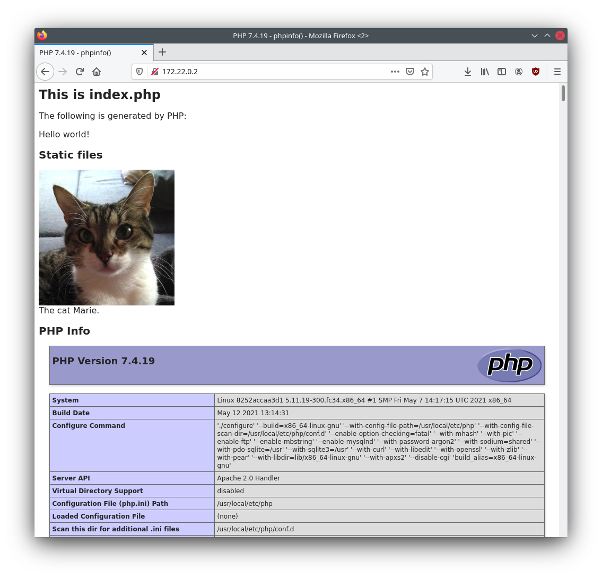

# Client - (Web-)Server mit PHP

## Allgemein

In diesem Beispiel wird ein einfacher PHP-Webserver im Container gestartet.
Es befindet sich ein einfaches PHP-Skript (`index.php`) im Verzeichnis,
das bei dem Zugriff http://localhost:8080 ausgeführt wird.



### Server

Nach dem Start des Servers kann das Skript direkt mit folgendem Aufruf geöffnet werden:

 * GET http://localhost:8080/
   * Allgemeiner Einstiegspunkt

Dies ist natürlich analog zu: http://localhost:8080/index.php.

Alle Dateien im Ordner `src` werden in den sogenannten `WEB_ROOT` des Webservers gelegt.
Daher sind alle Dateien im `src` Ordner über die URL zugänglich.

Darüber hinaus wird in der `index.php` auch gezeigt, wie man auf statische Dateien innerhalb
des Containers zugreifen kann, die sich im `src`-Ordner befinden.

## Ausführung mit Docker und docker-compose

In diesem Ordner können mit dem Terminal und folgendem Befehl:

```sh
# start mit
docker-compose up --build
```

automatisch der "Server"-Container gestartet werden.

Der Output sieht wie folgt aus:
```sh
Successfully built eeb1aaf87ec0
Successfully tagged php-client-server_server:latest
Starting php-client-server_server_1 ... done
Attaching to php-client-server_server_1
server_1  | AH00558: apache2: Could not reliably determine the server's fully qualified domain name, using 172.22.0.2. Set the 'ServerName' directive globally to suppress this message
server_1  | AH00558: apache2: Could not reliably determine the server's fully qualified domain name, using 172.22.0.2. Set the 'ServerName' directive globally to suppress this message
server_1  | [Mon May 24 18:25:37.736232 2021] [mpm_prefork:notice] [pid 1] AH00163: Apache/2.4.38 (Debian) PHP/7.4.19 configured -- resuming normal operations
server_1  | [Mon May 24 18:25:37.736287 2021] [core:notice] [pid 1] AH00094: Command line: 'apache2 -D FOREGROUND'
```

Um den Container zu stoppen, kann diese mittels [strg] + [c] beendet werden.

**Hinweis:** Sollte der Container nicht herunterfahren, dann kann [strg] + [c] nochmals gedrückt werden, um dies zu beschleunigen.

Der Output sieht wie folgt aus:
```sh
Gracefully stopping... (press Ctrl+C again to force)
Stopping php-client-server_server_1 ... 
# wenn nochmal [strg] + [c] gedrückt wird:
php-client-server_server_1  ... done
```

**Wichtig:** der Parameter `--build` sorgt dafür, dass bei jedem Aufruf von `docker-compose up` der Container neu gebaut wird, damit alle Änderungen im localen `src`-Ordner auch in den Container integriert werden.


## Informationen

 * PHP
   * W3Schools: https://www.w3schools.com/php/default.asp
   * W3Schools syntax & ff: https://www.w3schools.com/php/php_syntax.asp
   * W3Schools random: https://www.w3schools.com/PHP/func_math_rand.asp
   * W3Schools post: https://www.w3schools.com/Php/php_superglobals_post.asp
 * PHP Container
   * Official used container image: https://hub.docker.com/_/php/
     * Docker Slack: https://dockr.ly/slack
     * Info: https://github.com/docker-library/docs/tree/master/php