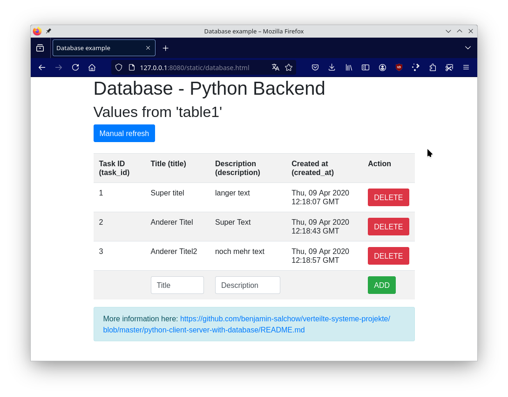

# Client - (Web-)Server mit einer Datenbank in Python Flask

## Allgemein

In diesem Beispiel werden ein Python Webserver (mittels Flask) gestartet und Zugriffspunkte (Pfäde) definiert. Darüber hinaus wird ein 'mariaDB'-Datenbankcontainer angelegt, welcher vom Webserver verwendet wird.



### Datenbank

Die Datenbank ist eine `MariaDB`-Datenbank, welche eine OpenSource Weiterentwicklung der `MySQL`-Datenbank ist.

Alles zur Datenbank findet man im Ordner `db`. Dieser wird benötigt, da beim Start der Datenbank das `database.sql` Backup geladen und in die Datenbank automatisch eingespielt wird.

Genau genommen nehmen wir das vorhandene offizielle `MariaDB` Container-Image und laden nur unser SQL-Backup rein. Das `database.sql` kann man über PhpMyAdmin exportieren und einfach überschreiben.

Die Datenbankinitialisierung findet **nur** statt, wenn der Container das erste Mal gestartet wird, sprich, wenn man das erste Mal `docker-compose up --build` ausführt. Bei jedem weiteren Start mittels `docker-compose up --build` werden die vorhandenen Daten genommen und es wird das Backup `database.sql` **nicht** eingespielt.

Konkret bedeutet das, dass beim ersten Start der Datenbank dies etwas länger dauert, bei jedem weiteren Start geht es deutlich schneller. Wenn man möchte, dass die Datenbank komplett gelöscht wird, dann muss man die Container alle löschen mittels `docker-compose down`. Beim nächsten Start mit `docker-compose up --build` wird dann die Datenbank neu erstellt.

### Server

Der Server benötigt die Datenbank und daher darf der Server erst starten, wenn die Datenbank bereit ist. Hierfür wurde eine Retry Logik eingebaut, welche nach dem Start mehrmalig versucht eine Verbindung aufzubauen.

Bitte öffne nach dem Start folgende URL: `http://localhost:8080/`

Danach wird man automatisch auf die `index.html` geleitet, die im `static` liegt (Ordner: `public` in `server`).
Mit einem Klick auf den `database.html` Link kommt man auf folgende Seite: `http://localhost:8080/static/database.html`.
Dort befindet sich alles über den Datenbankzugriff, was im Folgenden erklärt wird.

Die `database.html` befindet sich in `./server/public/database.html` und beinhaltet den Client (Webbrowser) Code, der im Browser ausgeführt wird.
Dabei werden folgende Zugriffspunkte vom `app.py` verwendet:

Zugriffspunkte:
 * GET http://localhost:8080/database
   * Gibt die komplette `table1` als JSON-Antwort zum Client.
 * DELETE http://localhost:8080/database/`id`
   * Löscht die Reihe aus der `table1` mit der angegebenen `id`.
 * POST http://localhost:8080/database
   * Das übergebene JSON-Objekt an diese URL, welches folgende Struktur haben muss:
   * `{ title: "", description: ""}`
   * wird zur `table1` hinzugefügt. Dabei werden die `task_id` sowie die `created_at` automatisch von der Datenbank ausgefüllt (siehe query im Sourcecode).

Darüber hinaus sind auch die Zugriffspunkte vom `node-client-server-extended` sind enthalten, aber in dieser Readme beschrieben: [- node-client-server-extended Beispiel ->](../node-client-server-extended/README.md)

Die `database.html` spielt dabei eine wichtige Rolle. In dieser Datei befindet sich `javascript` Code, welcher diese Anfragen stellt und auch in die HTML-Seite integriert (daher bitte die `database.html` anschauen).
Dabei gibt es auch ein Error-Handling, welches über den `alert` angezeigt wird. Jegliche Funktion wie löschen oder hinzufügen führt anschließend wieder das Laden der Datenbank aus, damit der neue Zustand gezeigt wird.

#### Datenbankverbindung

In dem Sourcecode wird die Datenbank automatisch vom `db`-Container beim Start initialisiert. Alternativ kann aber auch wie im `app.py` die Datenbank im Sourcecode angelegt werden (siehe auskommentierter Code am Anfang der Datei).

Bei dem Start von `app.py` wird die Verbindung zur Datenbank erstellt und auch getestet, damit diese später ohne Probleme vom Server verwendet werden kann.

**Hinweis:** In der Praxis muss man jegliche SQL-Query vor dem bekannten Angriff der `SQL-Injection` schützen. Dies sollte in der Vorlesung `IT-Sicherheit` erklärt werden.

### PhpMyAdmin

Im `docker-compose.yaml` wird auch ein `phpMyAdmin`-Container gestartet, der als Hilfestellung zum Erstellen, Testen sowie Debuggen der Datenbank dient. Dieser kann über:

`http://localhost:8085/`

erreicht werden. Hierbei muss man wie im `docker-compose.yaml` den Benutzernamen `MYSQL_USER` sowie das Passwort `MYSQL_PASSWORD` angeben. 

Dies kann auch für den Export verwendet werden mittels `Exportieren` -> `Schnell` -> `SQL`. Die daraus resultierende Datei kann dann in dem Ordner `db` als `database.sql` hinterlegt werden. Bei dem nächsten Neuerstellen des Datenbank-Containers wird diese dann automatisch geladen.

### Static Files

Alle statischen Dateien liegen wie bereits beschrieben in dem Ordner `public`, welcher über `/static/` per Webserver erreichbar ist. Am besten verwendet man relative Pfade zu den Dateien, so wie in der Datei `static.html`. Diese Datei befindet sich in `./server/public/static.html`.

In diesem Beispiel ist beschrieben, wie man Bilder und eigene CSS-Dateien referenzieren kann. Darüber hinaus können auch Javascript-Dateien so richtig ausgegliedert werden. Idealerweise überlegt man sich eine sinnvolle Ordnerstruktur, um dies auch gut warten zu können.

### Client

Der Client ist im Webbrowser, jedoch kann wie im `node-client-server-extended`-Beispiel [- node-client-server-extended Beispiel ->](../node-client-server-extended/README.md) ein eigener Client-Container angelegt werden, welcher die REST-Calls testet.

## Installation und lokale Ausführung

**Hinweis:** Beachte, dass die `docker-compose.yml` im Hauptverzeichnis des Projektes liegt. Der Ordner `server` beinhaltet den Python Flask Server Code, welcher mittels einer eigenen `Dockerfile` gebaut wird. Die Container sind unabhängig und unterscheiden sich. Innerhalb der `docker-compose.yml` wird unter `build` der Ordner angegeben, welcher die `Dockerfile` beinhaltet.

In den Verzeichnissen `server` können mittels:
```sh
pip3 install

```
alle definierten Bibliotheken im `requirements.txt` heruntergeladen werden.


Mit folgenden Befehlen können der Server und Client lokal ausgeführt werden:

```sh
# start des servers -> im "server"-Ordner
flask run --host=0.0.0.0 --port=8080
```

**Wichtig:** Die lokale Ausführung funktioniert nur, wenn alle notwendigen `Environmentvariablen` sowie die Datenbank erreichbar sind! Daher wird die Ausführung mittels `docker-compose` bei diesem Beispiel empfohlen!

## Ausführung mit Docker und docker-compose

In diesem Ordner können mit dem Terminal und folgendem Befehl:

```sh
# start mit
docker-compose up --build
```

automatisch der "Server"-Container und der "Client"-Container gestartet werden.
Darüber hinaus werden die Container `server` und `db` usw. mittels dem `--build` flag auch neu gebaut, damit aktuelle Änderungen enthalten sind.

Der Output sieht wie folgt aus:
```sh
Creating python-client-server-with-database_phpmyadmin_1   ... done
Creating python-client-server-with-database_meinecooledb_1 ... done
Creating python-client-server-with-database_server_1       ... done
Attaching to python-client-server-with-database_meinecooledb_1, python-client-server-with-database_phpmyadmin_1, python-client-server-with-database_server_1
[...]
meinecooledb_1  | Version: '11.3.2-MariaDB-1:11.3.2+maria~ubu2204'  socket: '/run/mysqld/mysqld.sock'  port: 3306  mariadb.org binary distribution
server_1        | INFO:root:Connected to the MariaDB database successfully.
server_1        | INFO:root:Database connected and works
server_1        |  * Serving Flask app 'app.py'
server_1        |  * Debug mode: off
server_1        | INFO:werkzeug:WARNING: This is a development server. Do not use it in a production deployment. Use a production WSGI server instead.
server_1        |  * Running on all addresses (0.0.0.0)
server_1        |  * Running on http://127.0.0.1:8080
server_1        |  * Running on http://10.89.0.4:8080
server_1        | INFO:werkzeug:Press CTRL+C to quit
```

Dabei wird auch im Log ausgegeben, wenn die `database.sql` geladen wird: `meinecooledb_1  | 2020-04-10 13:38:59+00:00 [Note] [Entrypoint]: /usr/local/bin/docker-entrypoint.sh: running /docker-entrypoint-initdb.d/database.sql`.

Um alle Container zu stoppen, können diese mittels [strg] + [c] beendet werden.

**Hinweis:** Sollte der Container nicht herunterfahren, dann kann [strg] + [c] nochmals gedrückt werden, um dies zu beschleunigen.

Der Output sieht wie folgt aus:
```sh
Gracefully stopping... (press Ctrl+C again to force)
Stopping python-client-server-with-database_server_1       ... 
Stopping python-client-server-with-database_meinecooledb_1 ... 
Stopping python-client-server-with-database_phpmyadmin_1   ... 
# wenn nochmal [strg] + [c] gedrückt wird:
Stopping python-client-server-with-database_server_1       ... done
Stopping python-client-server-with-database_meinecooledb_1 ... done
Stopping python-client-server-with-database_phpmyadmin_1   ... done
```

**Wichtig:** Der Parameter `--build` sorgt dafür, dass bei jedem Aufruf von `docker-compose up` alle Container neu gebaut werden, damit alle Änderungen in der `app.py` sowie im Datenbankschema `database.sql` in den jeweiligen Container integriert werden.


## Informationen

 * Flask
   * Webseite: https://flask.palletsprojects.com/en/3.0.x/
   * Dokumentation: https://flask.palletsprojects.com/en/3.0.x/api/#flask.Flask
   * Getting Started: https://flask.palletsprojects.com/en/3.0.x/#user-s-guide
 * MariaDB
   * Dockerhub: https://hub.docker.com/_/mariadb/
   * Homepage: https://mariadb.org/
   * Dokumentation: https://mariadb.org/documentation/
 * MariaDB-Client
   * Pypi: https://pypi.org/project/mariadb/
   * Repository: https://github.com/mariadb-corporation/mariadb-connector-python
 * Bootstrap (CSS für Table, usw.)
   * Homepage: https://getbootstrap.com/
   * Alerts: https://getbootstrap.com/docs/4.3/components/alerts/
   * Tabelle: https://getbootstrap.com/docs/4.0/content/tables/
   * Buttons: https://getbootstrap.com/docs/4.3/components/buttons/
 * W3Schools:
   * Button onclick Event: https://www.w3schools.com/jsref/event_onclick.asp
   * JSON HTML Table: https://www.w3schools.com/js/js_json_html.asp
   * AJAX: https://www.w3schools.com/xml/ajax_intro.asp
   * Node.js mysql: https://www.w3schools.com/nodejs/nodejs_mysql_where.asp
   * JSON: https://www.w3schools.com/js/js_json.asp
