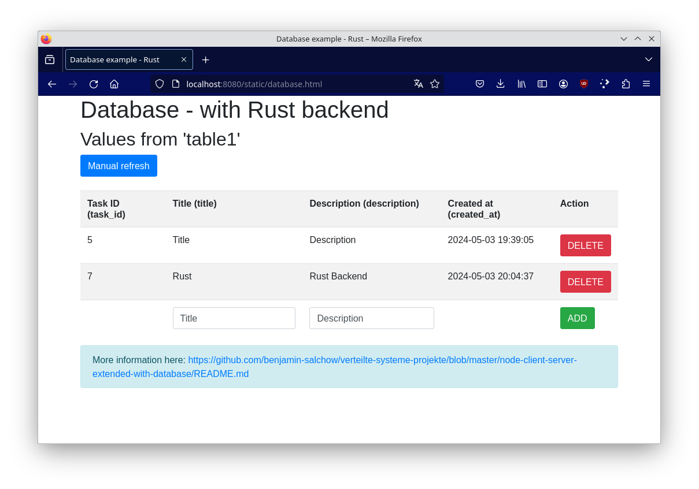

# Client - (Web-)Server Extended mit einer Datenbank in Rust

## Allgemein

In diesem Beispiel wird ein Rust-Webserver im Container (mittels Actix-web) gestartet und Zugriffspunkte (Pfäde) definiert. Darüber hinaus wird ein 'mariaDB'-Datenbankcontainer angelegt, welcher vom Webserver verwendet wird.

**Hinweis:** Dieses Beispiel ist für das Wahlfach "Programmieren in Rust" gedacht, kann aber auch gerne für "Verteilte Systeme" verwendet werden.

**Hinweis:** Dieses Beispiel ist auch in JavaScript in Node.JS verfügbar: [- node-client-server-extended-with-database Beispiel ->](../node-client-server-extended-with-database/README.md)




### Datenbank

Die Datenbank ist eine `MariaDB`-Datenbank, welche eine OpenSource-Weiterentwicklung der `MySQL`-Datenbank ist.

Alles zur Datenbank findet man im Ordner `db`. Dieser wird benötigt, da beim Start der Datenbank das `database.sql` Backup geladen und in die Datenbank automatisch eingespielt wird.

Genau genommen nehmen wir das vorhandene offizielle `MariaDB` Container-Image und laden nur unser SQL-Backup rein. Das `database.sql` kann man über PhpMyAdmin exportieren und einfach überschreiben.

Die Datenbankinitialisierung findet **nur** statt, wenn der Container das erste Mal gestartet wird, sprich, wenn man das erste Mal `docker-compose up --build` ausführt. Bei jedem weiteren Start mittels `docker-compose up --build` werden die vorhandenen Daten genommen und es wird das Backup `database.sql` **nicht** eingespielt.

Konkret bedeutet das, dass beim ersten Start der Datenbank dies etwas länger dauert, bei jedem weiteren Start geht es deutlich schneller. Wenn man möchte, dass die Datenbank komplett gelöscht wird, dann muss man die Container alle löschen mittels `docker-compose down`. Beim nächsten Start mit `docker-compose up --build` wird dann die Datenbank neu erstellt.

### Server

Der Server benötigt die Datenbank und daher darf der Server erst starten, wenn die Datenbank bereit ist. 

Bitte öffne nach dem Start folgende URL: `http://localhost:8080/`

Danach wird man automatisch auf die `index.html` geleitet, die im `public`-Ordner des Servers liegt.
Mit einem Klick auf den `database.html` Link kommt man auf folgende Seite: `http://localhost:8080/static/database.html`.
Dort befindet sich alles über den Datenbankzugriff, was im Folgenden erklärt wird.

Der allgemeine Zugangspunkt ist:
 * GET http://localhost:8080/
   * Allgemeiner Einstiegspunkt, der automatisch den Client zu http://localhost:8080/index.html weiterleitet.

#### Button-Beispiel
Dieses Projekt beinhaltet ein `Button`-Beispiel, welches klassisch sowie mit `AJAX` funktioniert.
Alle dazugehörigen Informationen können in der Datei `button.html` (Webseite) sowie in der
`main.rs` nachgeschaut werden.

Folgende Zugriffspunkte stehen hierbei zur Verfügung:
 * POST http://localhost:8080/button
   * Button 1 Beispiel von der static Webseite - `server/public/index.html`.
   * Der Name im Formular wird an den Server geschickt und in diesem Beispiel wieder zurück zu dem Client in einem JSON.
 * GET http://localhost:8080/button
   * Button 2 Beispiel von der static Webseite - `server/public/index.html`.
   * Diese wird durch AJAX automatisch in der aktuellen Seite eingebunden und angezeigt.
   * Weitere Informationen: https://www.w3schools.com/xml/ajax_intro.asp

#### Datenbank-Beispiel
Die `database.html` befindet sich in `./server/src/database.html` und beinhaltet den Client (Webbrowser) Code, der im Browser ausgeführt wird. Funktionen werden jedoch vom Actix Server `main.rs` bereitgestellt, was im Ordner `src` liegt.

Dabei werden folgende Zugriffspunkte (API) von dem Actix Server bereitgestellt:

Zugriffspunkte:
 * GET http://localhost:8080/database
   * Gibt die komplette `table1` als JSON-Antwort zum Client.
 * DELETE http://localhost:8080/database/`id`
   * Löscht die Reihe aus der `table1` mit der angegebenen `id`.
 * POST http://localhost:8080/database
   * Das übergebene JSON-Objekt an diese URL, welches folgende Struktur haben muss:
   * `{ title: "", description: ""}`
   * wird zur `table1` hinzugefügt. Dabei werden die `task_id` sowie die `created_at` automatisch von der Datenbank ausgefüllt (siehe query im Sourcecode).

Die `database.html` spielt dabei eine wichtige Rolle. In dieser Datei befindet sich `javascript` Code, welcher diese Anfragen stellt und auch in die HTML-Seite integriert (daher bitte die `database.html` anschauen).
Dabei gibt es auch ein Error-Handling, welches über den `alert` angezeigt wird. Jegliche Funktion wie löschen oder hinzufügen führt anschließend wieder das Laden der Datenbank aus, damit der neue Zustand gezeigt wird.

#### Datenbankverbindung

In dem Sourcecode wird die Datenbank automatisch vom `db`-Container beim Start initialisiert.

In der `main.rs` wird die Verbindung mit der Datenbank automatisch aufgebaut. Hierfür werden wie beschrieben die Environment-Variablen verwendet,
welche von der `docker-compose.yaml` definiert werden.

**Hinweis:** In diesem Beispiel befinden sich die Datenbank calls in der `main.rs`. Natürlich wäre es sinnvoll, dies in eine separate `db.rs` oder ähnlich auszulagern. Im Sourcecode in der `main.rs` wird ein Connection Pool angelegt, welcher der Runtime übergeben wird und somit voll asynchron verwendet werden kann.

**Hinweis:** In der Praxis muss man jegliche SQL-Query vor dem bekannten Angriff der `SQL-Injection` schützen. Dies sollte in der Vorlesung `IT-Sicherheit` erklärt werden.

### PhpMyAdmin

Im `docker-compose.yaml` wird auch ein `phpMyAdmin`-Container gestartet, der als Hilfestellung zum Erstellen, Testen sowie Debuggen der Datenbank dient. Dieser kann über:

`http://localhost:8085/`

erreicht werden. Hierbei muss man wie im `docker-compose.yaml` den Benutzernamen `MYSQL_USER` sowie das Passwort `MYSQL_PASSWORD` angeben. 

Dies kann auch für den Export verwendet werden mittels `Exportieren` -> `Schnell` -> `SQL`. Die daraus resultierende Datei kann dann in dem Ordner `db` als `database.sql` hinterlegt werden. Bei dem nächsten Neuerstellen des Datenbank-Containers wird diese dann automatisch geladen.

### Static Files

Alle statischen Dateien liegen in dem Ordner `public`, welche über http://127.0.0.1:8080/static verfügbar sind. Am besten werden relative Pfade zu den Dateien verwendet (siehe z.B. `static.html` Datei). Diese Datei befindet sich in `./server/public/static.html`.

In diesem Beispiel ist beschrieben, wie man Bilder und eigene CSS-Dateien referenzieren kann. Darüber hinaus können auch Javascript-Dateien so richtig ausgegliedert werden. Idealerweise überlegt man sich eine sinnvolle Ordnerstruktur, um dies auch gut warten zu können.

## Bauen

Das Projekt kann lokal sowie mit docker-compose gebaut werden. Da Rust erst übersetzt werden muss, kann in diesem Fall direkt `cargo build` verwendet werden. Der Server erwartet, dass die benötigten Informationen zum Verbinden bereits als Environment-Variablen (oder .env File) vorgegeben werden. Diese werden von docker-compose automatisch gesetzt und verwendet.

Um das Bauen zu beschleunigen, wird im Docker Build Container des Servers eine Layer-Technik verwendet. Zuerst werden nur die Dependencies (`cargo.toml` und `cargo.lock`) in den Container gezogen, mit dem Cache Parameter gebaut und erst danach der Sourcecode (welcher sich häufig ändert). Dadurch spart man sich bei jedem Container-Build die Zeit zum Bauen der Libaries.

Aktuell läuft der Server auf Debian, es ist jedoch schon in der Dockerfile die Verwendung von Alpine-Linux vorbereitet. 

## Testing

Das Projekt hat auch ein kleines Test-Beispiel, welche die API button_1 testet. Dieser Test wird automatisch bei jedem Bauen des Containers durchgeführt.

## Ausführung mit Docker und docker-compose

**Hinweis:** Beachte, dass die `docker-compose.yml` im Hauptverzeichnis des Projektes liegt. Die Ordnerstruktur enthält einen Ordner `db` und einen Ordner `server`, welche jeweils die benötigten Dateien sowie eine eigene `Dockerfile` haben, welche die Container beschreiben. Die Container sind unabhängig und unterscheiden sich. Innerhalb der `docker-compose.yml` wird unter `build` der Ordner angegeben, welcher die `Dockerfile` beinhaltet.


In diesem Ordner können mit dem Terminal und folgendem Befehl:

```sh
# start mit
docker-compose up --build
```

automatisch der "Server"-Container und der "Client"-Container gestartet werden.
Darüber hinaus werden die beiden Container `server` und `client` mittels dem `--build` flag auch neu gebaut, damit aktuelle Änderungen enthalten sind.

Der Output sieht wie folgt aus:
```sh
Creating rust-client-server-with-database_meinecooledb_1 ... done
Creating rust-client-server-with-database_phpmyadmin_1   ... done
Creating rust-client-server-with-database_server_1       ... done
Attaching to rust-client-server-with-database_phpmyadmin_1, rust-client-server-with-database_meinecooledb_1, rust-client-server-with-database_server_1
meinecooledb_1  | 2024-05-03 20:07:57+00:00 [Note] [Entrypoint]: Entrypoint script for MariaDB Server 1:11.3.2+maria~ubu2204 started.
meinecooledb_1  | 2024-05-03 20:07:57+00:00 [Warn] [Entrypoint]: /sys/fs/cgroup///memory.pressure not writable, functionality unavailable to MariaDB
[...]
meinecooledb_1  | 2024-05-03 20:08:09 0 [Note] Server socket created on IP: '0.0.0.0'.
meinecooledb_1  | 2024-05-03 20:08:09 0 [Note] Server socket created on IP: '::'.
meinecooledb_1  | 2024-05-03 20:08:09 0 [Note] mariadbd: Event Scheduler: Loaded 0 events
meinecooledb_1  | 2024-05-03 20:08:09 0 [Note] mariadbd: ready for connections.
meinecooledb_1  | Version: '11.3.2-MariaDB-1:11.3.2+maria~ubu2204'  socket: '/run/mysqld/mysqld.sock'  port: 3306  mariadb.org binary distribution
server_1        | [2024-05-03T20:08:12Z INFO  server] Starting HTTP server: go to http://localhost:8080
server_1        | [2024-05-03T20:08:12Z INFO  actix_server::builder] starting 8 workers
server_1        | [2024-05-03T20:08:12Z INFO  actix_server::server] Actix runtime found; starting in Actix runtime
```

Dabei wird auch im Log ausgegeben, wenn die `database.sql` geladen wird: `meinecooledb_1  | 2024-05-03 20:08:00 [Note] [Entrypoint]: /usr/local/bin/docker-entrypoint.sh: running /docker-entrypoint-initdb.d/database.sql`.

Um alle Container zu stoppen, können diese mittels [strg] + [c] beendet werden.

**Hinweis:** Sollte der Container nicht herunterfahren, dann kann [strg] + [c] nochmals gedrückt werden, um dies zu beschleunigen.

Der Output sieht wie folgt aus:
```sh
Gracefully stopping... (press Ctrl+C again to force)
Stopping rust-client-server-with-database_phpmyadmin_1   ... 
Stopping rust-client-server-with-database_meinecooledb_1 ... 
Stopping rust-client-server-with-database_server_1       ... 
# wenn nochmal [strg] + [c] gedrückt wird:
Stopping rust-client-server-with-database_phpmyadmin_1   ... done
Stopping rust-client-server-with-database_meinecooledb_1 ... done
Stopping rust-client-server-with-database_server_1       ... done
```

**Wichtig:** Der Parameter `--build` sorgt dafür, dass bei jedem Aufruf von `docker-compose up` der Container neu gebaut wird, damit alle Änderungen im localen `src`-Ordner auch in den Container integriert werden.


## Informationen

 * Rust
   * Rust Book: https://doc.rust-lang.org/stable/book/
   * Learn Rust landing page: https://www.rust-lang.org/learn
   * Actix Web: https://actix.rs/
   * Actix Docs: https://actix.rs/docs/
   * Actix Example: https://github.com/actix/examples
 * MariaDB
   * Dockerhub: https://hub.docker.com/_/mariadb/
   * Homepage: https://mariadb.org/
   * Dokumentation: https://mariadb.org/documentation/
 * MySQL-Client W3Schools
   * mysql rust: https://docs.rs/crate/mysql/latest
 * Bootstrap (CSS für Table, usw.)
   * Homepage: https://getbootstrap.com/
   * Alerts: https://getbootstrap.com/docs/4.3/components/alerts/
   * Tabelle: https://getbootstrap.com/docs/4.0/content/tables/
   * Buttons: https://getbootstrap.com/docs/4.3/components/buttons/
 * W3Schools AJAX und JS:
   * Button onclick Event: https://www.w3schools.com/jsref/event_onclick.asp
   * JSON HTML Table: https://www.w3schools.com/js/js_json_html.asp
   * AJAX: https://www.w3schools.com/xml/ajax_intro.asp
   * JSON: https://www.w3schools.com/js/js_json.asp
